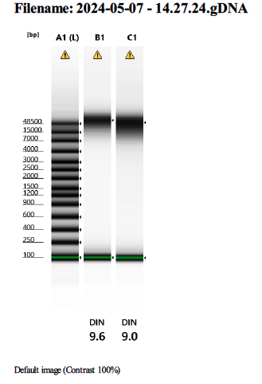
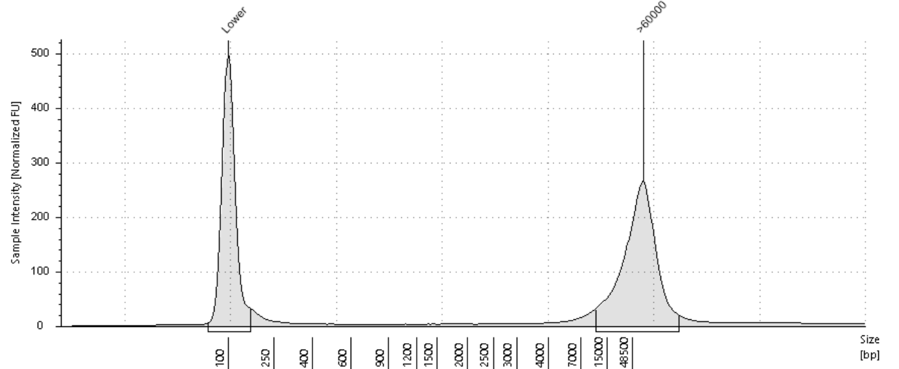
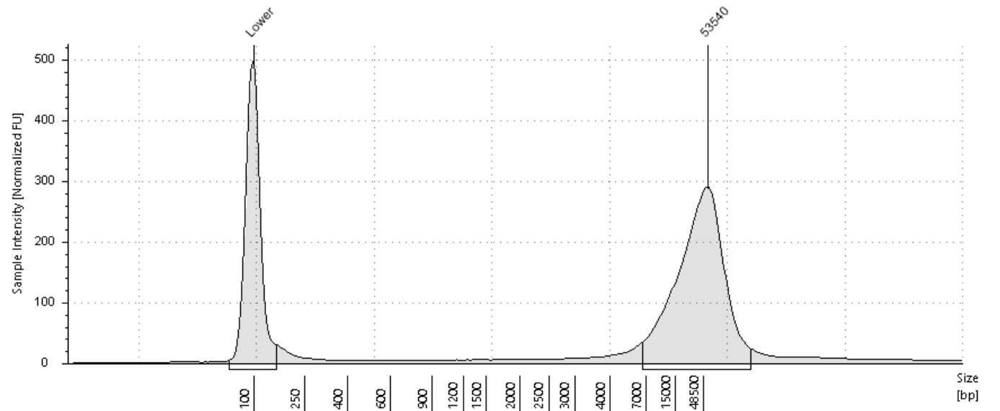

```{r setup, include=FALSE}
knitr::opts_chunk$set(echo = TRUE)
```

# Summary

### Overview

2013 Gar Tissue pulled from the Kelley Lab -80, Top Rack A, column 3, Row 4 and 5

[Drive folder link](https://drive.google.com/drive/folders/18Grc9RU8b1AgnpR51Xi0QxQu8HY615x5?usp=drive_link)

### Planning

Extraction plan: Dry Ice Cryofracture of Tissues and Circulomics HMW DNA Extraction kit with modifications

-   aim for up to 50 mg of sample input

-   200 ul and 400 ul of cold Buffer CT (respectively in OOO, both below std amount)

-   centrifuge spins will be at 10G

-   warm EB to 70C to improve yield

##### Sequencing strategy

*Sample will be sent to Davis for Pac Bio Sequencing I assume*

# Sample data

Experiment 21

Month of Experiment: 4/24

### Cryofracture:

+------------+--------------+-----------------+----------------------+------------------------+-----------------------------------+
| Experiment | Date of Exp. | Sample          | Cryofracture Tube ID | input tissue weight mg | notes                             |
+------------+--------------+-----------------+----------------------+------------------------+-----------------------------------+
| 21a        | 4/18/24      | Male Gar Muscle | Gar                  | 49.5                   | muscle initially weighed 114 mg   |
|            |              |                 |                      |                        |                                   |
|            |              | 20/6/13         |                      |                        |                                   |
+------------+--------------+-----------------+----------------------+------------------------+-----------------------------------+
| 21c        | 4/25/24      | Male Gar Muscle | Gar II               | 45                     | other half of 21a skeletal muscle |
|            |              |                 |                      |                        |                                   |
|            |              | 20/6/13         |                      |                        |                                   |
+------------+--------------+-----------------+----------------------+------------------------+-----------------------------------+
| 21d        | 4/29/24      | Male Gar liver  | Gar III              | 24.5                   | lower sample input this time      |
|            |              |                 |                      |                        |                                   |
|            |              | 20/6/13         |                      |                        |                                   |
+------------+--------------+-----------------+----------------------+------------------------+-----------------------------------+

### Post Extraction:

#### Circulomics Extractions 

|                                      |                          |                                                   |             |                           |           |           |                                              |             |     |
|--------|--------|--------|--------|--------|--------|--------|--------|--------|--------|
| Tube ID                              | Qubit ng/ul 1:5 dilution | ng/ul of undiluted based on measured 1:5 dilution | elution vol | total yield micrograms ug | A260/A280 | A260/A230 | tapestation avg size bp from 14779 - \>60000 | \% of total | DIN |
| Gar HMW                              | 12.6                     | 63                                                | 75          | 4.725                     | 1.7       | .95       | \>60000                                      | 83.02       | 9.8 |
| 2nd QC aliquot                       | 17.6                     | 88                                                | 75          | 6.6                       | 1.7       | .8        |                                              |             |     |
| Post 3.1x bead cleanup               | 7.77                     | 38.85                                             | 30          | 1.1655                    | 1.846     | 0.847     |                                              |             |     |
| Gar HiFi                             | 5.79                     | 28.95                                             | 75          | 2.17125                   | 1.837     | 1.27      |                                              |             |     |
| Gar Liver HMW                        | 2.7                      | 13.5                                              | 75          | 1.0125                    | 1.69      | 0.6025    |                                              |             |     |
| Liver Supernatant                    | 19.7                     | 98.5                                              | 50          | 4.925                     | 1.672     | 0.7081    |                                              |             |     |
| CW1 washes                           | 2.46                     | 12.3                                              | 50          | 0.615                     | 1.696     | 0.5945    |                                              |             |     |
| CW2 washes                           | 6.04                     | 30.2                                              | 50          | 1.51                      | 1.7       | 0.5916    |                                              |             |     |
| liver Supernatant rnase bead cleanup | 16.7                     | 83.5                                              | 20          | 1.7                       | 1.64      | 0.8566    |                                              |             |     |
|                                      |                          |                                                   |             |                           |           |           |                                              |             |     |

#### Tapestation Results


#### Omega Extractions

<table style="width:83%;">
<colgroup>
<col style="width: 8%" />
<col style="width: 8%" />
<col style="width: 8%" />
<col style="width: 8%" />
<col style="width: 8%" />
<col style="width: 8%" />
<col style="width: 8%" />
<col style="width: 8%" />
<col style="width: 8%" />
<col style="width: 8%" />
</colgroup>
<tbody>
<tr class="odd">
<td><p>Tube ID</p></td>
<td><p>Qubit ng/ul 1:5 dilution</p></td>
<td><p>ng/ul of undiluted based on measured 1:5 dilution</p></td>
<td><p>elution vol</p></td>
<td><p>total yield micrograms ug</p></td>
<td><p>A260/A280</p></td>
<td><p>A260/A230</p></td>
<td><p>tapestation avg size bp from 14779 - &gt;60000</p></td>
<td><p>% of total</p></td>
<td><p>DIN</p></td>
</tr>
<tr class="even">
<td><p>240506 Gar Liver 1</p></td>
<td><p>22.5</p></td>
<td><p>112.5</p></td>
<td><p>75</p></td>
<td><p>8.4</p></td>
<td><p>1.7</p></td>
<td><p>0.86</p></td>
<td><p>&gt;60,000</p></td>
<td><p>83</p></td>
<td><p>9.6</p></td>
</tr>
<tr class="odd">
<td><p>240506 Gar Liver 2</p></td>
<td><p>4.75</p></td>
<td><p>23.75</p></td>
<td><p>75</p></td>
<td><p>1.8</p></td>
<td><p>1.7</p></td>
<td><p>0.78</p></td>
<td></td>
<td></td>
<td></td>
</tr>
<tr class="even">
<td><p>CNC Gar 2</p></td>
<td><p>13.5</p></td>
<td><p>67.5</p></td>
<td><p>15</p></td>
<td><p>1.0</p></td>
<td><p>1.9</p></td>
<td><p>2.2</p></td>
<td><p>53540</p></td>
<td><p>84.77</p></td>
<td><p>9.0</p></td>
</tr>
</tbody>
</table>

#### Tapestation Results



240506 Gar Liver 1 - Col B1



CNC Gar 2 - Col C1



## Sample Storage

##### Tissue

tube id: Gar muscle male 20/6/13, sample is now fully consumed

tube id: Gar liver male 20/6/13, Kelley Lab 4C

##### DNA extracts:

box label: pink box

storage location and temperature: Kelley Lab 4C

# [Exp21a](https://docs.google.com/spreadsheets/d/1y7E_nPqIrszB74X549kRu-dw5WyIRJrkGchXJyn7OJM/edit?usp=drive_link){.uri} Extraction

## Materials List

+------------------+----------------+-------------------------------+--------------------------------------+
| tissueTUBE TT05M | Slammer kit    | Circulomics Kit               | DNA lo bind tubes for sample storage |
+------------------+----------------+-------------------------------+--------------------------------------+
| milliTUBE 2mL    | 100% ethanol   | RNase A                       | **things to label**                  |
+------------------+----------------+-------------------------------+--------------------------------------+
| Dry Ice          | Ice n bucket   | mag rack                      | smash bag                            |
+------------------+----------------+-------------------------------+--------------------------------------+
| 100% Isopropanol | p1000 tips     | NFW-optional                  | 2ml Protein loBind                   |
+------------------+----------------+-------------------------------+--------------------------------------+
| ice bucket       | p200 tips      | protein lo bind tubes 1.5/2mL | 1.5 mL Protein LoBind                |
+------------------+----------------+-------------------------------+--------------------------------------+
| hammer           | Dissection kit | Qubit dsDNA BR                | 1.5 mL DNA LoBind                    |
+------------------+----------------+-------------------------------+--------------------------------------+

## Kit Particulars & Lot Numbers

| part             | part no | lot    |
|------------------|---------|--------|
| Circulomics kit  |         | 10043  |
| tissueTUBE TT05M |         | 004895 |

##### Circulomics Kit components

|                                                              |
|--------------------------------------------------------------|
| Buffer CT - keep on ice when it is removed from refrigerator |
| Buffer CLE3                                                  |
| Buffer SB                                                    |
| Proteinase K                                                 |
| Rnase A                                                      |
| Buffer BL3                                                   |
| Buffer CW1                                                   |
| Buffer CW2                                                   |
| Nanobind disk                                                |

Buffer CW1 and CW2 are supplied as concentrates.\
This kit uses CW1 & CW2 a 60% final ethanol concentration.\
Before using, add the appropriate amount of ethanol\
(96–100%) to Buffer CW1 and Buffer CW2 as indicated on the bottles

# [Exp21b](https://docs.google.com/spreadsheets/d/1y7E_nPqIrszB74X549kRu-dw5WyIRJrkGchXJyn7OJM/edit?usp=sharing){.uri} 3.1xBeadCleanup

## Materials List

+--------------------------------------------------------------------------+
| AMPure PB Beads                                                          |
+--------------------------------------------------------------------------+
| Elution Buffer ~~Pacific Biosciences 101-633-500~~ 10 mM Tris-Cl, pH 8.5 |
+--------------------------------------------------------------------------+
| 2 ml tube                                                                |
+--------------------------------------------------------------------------+
| Wide Orifice Tips                                                        |
+--------------------------------------------------------------------------+
| 1X dsDNA HS Assay kit & Qubit 4.0 fluorometer                            |
+--------------------------------------------------------------------------+
| 1.5ml/2ml tube magnet                                                    |
+--------------------------------------------------------------------------+

# [Exp21c](https://docs.google.com/spreadsheets/d/1y7E_nPqIrszB74X549kRu-dw5WyIRJrkGchXJyn7OJM/edit?usp=drive_link){.uri} Extraction II

Same protocol as 21a but with the other half of the skeletal muscle tissue

input 45 mg

# [Exp21d](https://docs.google.com/spreadsheets/d/1y7E_nPqIrszB74X549kRu-dw5WyIRJrkGchXJyn7OJM/edit?usp=drive_link){.uri} Extraction III

Same protocol as 21a but with Gar liver tissue, lower sample input amount and additional washes

input 25.4 mg

Post

# [Exp21e](https://docs.google.com/spreadsheets/d/1y7E_nPqIrszB74X549kRu-dw5WyIRJrkGchXJyn7OJM/edit?usp=drive_link){.uri} Rnase + Bead Cleanup

Took the supernatant from the liver extraction and tried to remove the RNA contamination.

# [Exp21](https://docs.google.com/spreadsheets/d/1y7E_nPqIrszB74X549kRu-dw5WyIRJrkGchXJyn7OJM/edit?usp=drive_link){.uri}f Rnase + Bead Cleanup

Gar Hifi rnase digestion and bead cleanup

20 ul rnase A, 30 min incubate at 55c followed by .45x bead cleanup

75 ul elution incubated at 37c for 15 minutes prior to transfer away from beads

Pretty much lost all of the sample.

# Log

### April 18, 2024

Sample was stored in the -80, removed and thawed on ice on 4/12/24, and placed in the 4C until today's extraction.

A portion of the muscle sample was apportioned, weighed and cryofractured. Protocol execution was unremarkable.

#### Next Steps

QC on 4/20/24

### April 19, 2024

Made a 1:5 dilution of HMW sample using 2 ul of sample and 8 ub EB

consumed 1 ul of dilution for HS dsDNA Qubit Quantitative assessment, consumed 2 ul of dilution for uDrop Qualitative assessment

Based on results of Qubit decided to consume 1 ul of undiluted sample for Tapestation fragment analysis

decided to put undiluted Gar HMW sample in thermomixer set at 24 C. Jellies of unsolubilized DNA still appeared present in tube. Per recco's of std protocol 2 hours additional time at RT should help with solubilization. Will want to redo quant and qual with fresh dilution post incubation.

### April 22, 2024

Made a second 1:5 aliquot of the Gar HMW sample using 2 ul of sample and 8 ub EB

Redid Qubit and udrop and did additional nanodrop qualitative assessment

consumed 6 ul of 1:5 for qubit, udrop and nanodrop QC

results showed a low 260/230 and a decent A260/280

Notes:

might have transferred the " waxy or opaque residue" during step 20 of the extraction... Transfer up to 300 μL of supernatant thinking it was the gel like matrix of DNA.

Potential solves for the low 260/230 include the 3.1x Bead Size Selection or the Genomic DNA Clean & Concentrator®-10 or a redo of the extraction.

### April 23, 2024

To address the low 260/230 will be doing a 3.1x bead cleanup on the sample

*Also want sample concentration to be above 100 ng/ul post clean up*

Have 70 ul of 88ng/ul sample = 6.6 micrograms.

Assuming 20% loss from bead cleanup will have 4.9 micrograms post clean up

32 ul should give a concentration of 150 ng/ul

#### - results of bead clean up -

no good. lost alot of sample and purity stayed the same (bad)

### April 25, 2024

Extraction number 2: Same protocol as 21a but with the other half of the skeletal muscle tissue

avoided transfer of impurities at step 20 as much as possible this time around

### April 26, 2024

QC results show low yield, good A260/280 and an A260/230 that is better than the first extraction but is still not sufficient for sample submission to Davis for PacBio

<https://dnatech.genomecenter.ucdavis.edu/sample-requirements/>

Upon reflection of MB eelpout HMW extraction noticed that sample input of 21 mg yielded a better A260/230. Might try that if have to do a third extraction

Probably should have done a different sample type (liver?)

### April 29, 2024

Extraction number 3 with the same protocol as 21a but with input that's 20-25 mg and liver tissue this time instead.\
Pellet upon 4C centrifuge steps was noticeably more *pellety* and more clearly delineated in the tube. was more confident about removal of supernatant than with the skeletal muscle samples.

Add additional round of washes per recco of MC

in talk with MC it seems like the 3.1x bead cleanup was not the right move for cleaning up the initial extraction

Post incubation with Nanobind disk noticed a cloud of opaque matter surround disk and be dropped into supernatant.

Proceeded with washes and standard protocol but also set aside the supernatant, cw1 washes and cw2 washes for side purifications of the opaque matter.

*Set aside tubes were processed as follows:* spun down washes for 10G for 5 min, removed supernatant from the pellet, two washes of: rinse with .5ml 80% etoh, spin down for 5 min at 10g, supernatant removed. after removing as much ethanol as possible post second wash added in 50ul of elution buffer and let sample rest at 4C overnight. In the morning set tubes to incubate for 1 hour at 50C

QC results did not look good for any of the 4 samples. Yield and purity were both bad

Noticed a size-able discrepancy between the Varioskan [ ] and the Qubit [ ]

*theory is the RNase A isn't working*

reviewed all other extractions and saw a trend of

<https://www.qiagen.com/us/resources/faq?id=b97ed929-58d6-48f5-a4d2-6bf959483d7b&lang=en>

### May 01, 2024

So what I did do was do a RNaseA digestion on the gar liver supernatant. I don't think I added in enough RNase and I think the results indicate that.

2 ul of RNase A, 55c incubation for 30 min followed up with a 1.8x bead cleanup eluted in 22 ul

Poor recovery. RNA still measurable present. A260/230 and A260/280 still bad

-   [DNA](1.7%20ng/ul) 1:5 dilution: 16.7

-   [RNA](Too%20Low%20out%20of%20range) 1:5 dilution: 3.33

-   A260/A280 undiluted sample: 1.64

-   A260/A230 undiluted sample: 0.85

### May 02, 2024

Gar Hifi rnase digestion and bead cleanup

20 ul rnase A, 30 min incubate at 55c followed by .45x bead cleanup

75 ul elution incubated at 37c for 15 minutes prior to transfer away from beads

-   

-   

-   uDrop quant: 17.15 ng/ul

-   A260/A280 undiluted sample: 1.5

-   A260/A230 undiluted sample: .72

### Notes

Tissue selection: Fish skeletal muscle is not recommended if other fish tissues are available (e.g., heart, testes, fin clip, kidney)

Double input of sample if using skeletal muscle. Still a good candidate b/c parasite fraction might be lower

## References:

[Nanobind HMW DNA Extraction with recommendations from rep](https://drive.google.com/file/d/1smMY0uxOhxlPnjGG64oUt5MbmyeVj_kr/view?usp=drive_link){.uri}

<https://assets.thermofisher.com/TFS-Assets/LSG/manuals/MAN0017209_Qubit_4_Fluorometer_UG.pdf>

<https://www.agilent.com/cs/library/usermanuals/public/4150-TapeStation_SystemManual.pdf>

<https://www.pacb.com/wp-content/uploads/Procedure-checklist-Homogenizing-tissue-using-cryoPREP.pdf>

find the manual for the nanodrop machine
