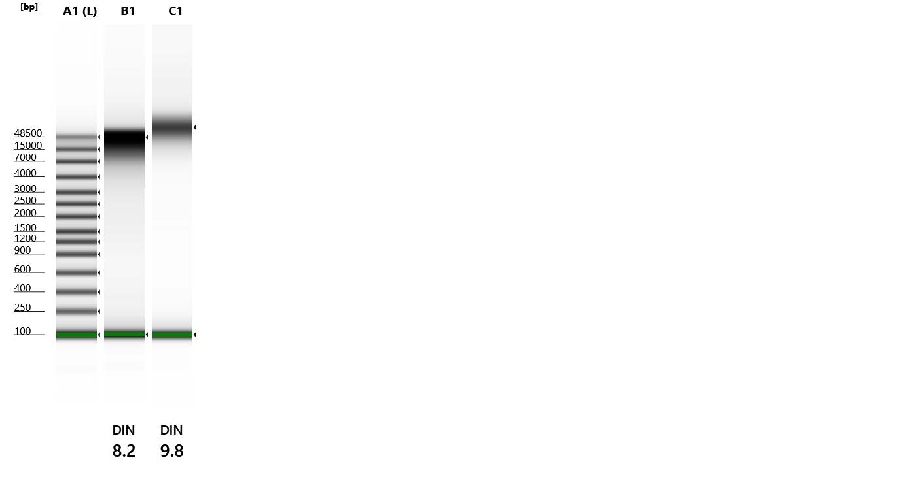
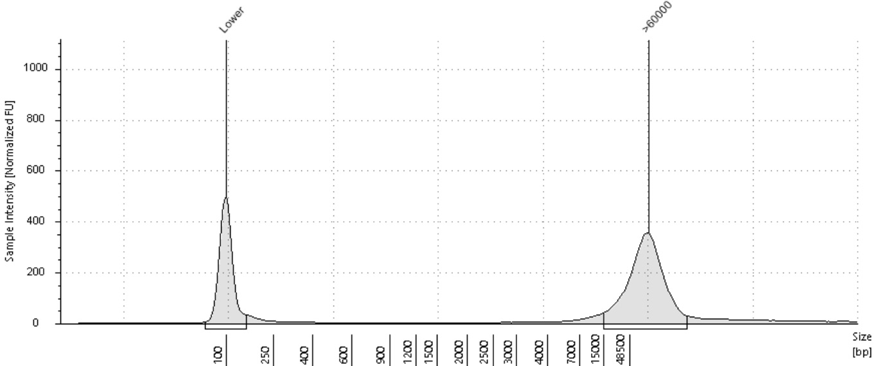

```{r setup, include=FALSE}
knitr::opts_chunk$set(echo = TRUE)
```

# Summary

### Overview

2013 Gar Tissue pulled from the Kelley Lab -80, Top Rack A, column 3, Row 4 and 5

[Drive folder link](https://drive.google.com/drive/folders/18Grc9RU8b1AgnpR51Xi0QxQu8HY615x5?usp=drive_link)

### Planning

Extraction plan: Dry Ice Cryofracture of Tissues and Circulomics HMW DNA Extraction kit with modifications

-   aim for up to 50 mg of sample input

-   200 ul and 400 ul of cold Buffer CT (respectively in OOO, both below std amount)

-   centrifuge spins will be at 10G

-   warm EB to 70C to improve yield

##### Sequencing strategy

*Sample will be sent to Davis for Pac Bio Sequencing I assume*

# Metadata

## Sample Data

Experiment

Date of Experiment:

### Cryofracture:

+------------+--------------+-----------------+----------------------+------------------------+---------------------------------+
| Experiment | Date of Exp. | Sample          | Cryofracture Tube ID | input tissue weight mg | notes                           |
+------------+--------------+-----------------+----------------------+------------------------+---------------------------------+
| 21         | 4/18/24      | Male Gar Muscle | Gar                  | 49.5                   | muscle initially weighed 114 mg |
|            |              |                 |                      |                        |                                 |
|            |              | 20/6/13         |                      |                        |                                 |
+------------+--------------+-----------------+----------------------+------------------------+---------------------------------+

### Post Extraction:

<table style="width:99%;">
<colgroup>
<col style="width: 9%" />
<col style="width: 9%" />
<col style="width: 9%" />
<col style="width: 9%" />
<col style="width: 9%" />
<col style="width: 9%" />
<col style="width: 9%" />
<col style="width: 9%" />
<col style="width: 9%" />
<col style="width: 9%" />
</colgroup>
<tbody>
<tr class="odd">
<td><p>Tube ID</p></td>
<td><p>Qubit ng/ul 1:5 dilution</p></td>
<td><p>ng/ul of undiluted based on measured 1:5 dilution</p></td>
<td><p>elution vol</p></td>
<td><p>total yield micrograms ug</p></td>
<td><p>A260/A280</p></td>
<td><p>A260/A230</p></td>
<td><p>tapestation avg size bp from 14779 - &gt;60000</p></td>
<td><p>% of total</p></td>
<td><p>DIN</p></td>
</tr>
<tr class="even">
<td><p>Gar HMW</p></td>
<td><p>12.6</p></td>
<td><p>63</p></td>
<td><p>75</p></td>
<td><p>4.725</p></td>
<td><p>1.7</p></td>
<td><p>.95</p></td>
<td><p>&gt;60000</p></td>
<td><p>83.02</p></td>
<td><p>9.8</p></td>
</tr>
<tr class="odd">
<td><p>2nd QC aliquot</p></td>
<td><p>17.6</p></td>
<td><p>88</p></td>
<td><p>75</p></td>
<td><p>6.6</p></td>
<td><p>1.7</p></td>
<td><p>.8</p></td>
<td></td>
<td></td>
<td></td>
</tr>
</tbody>
</table>

#### Tapestation Results

{alt="Gar Muscle Extraction is Col C1"}



## 

## Sample Storage

##### Tissue

tube id: Gar muscle male 20/6/13

box label: pink box

storage location and temperature: 4C

##### DNA extract:

tube id: Gar HMW

box label: pink box

storage location and temperature: 4C

# [Exp21_Protocol](https://docs.google.com/spreadsheets/d/1y7E_nPqIrszB74X549kRu-dw5WyIRJrkGchXJyn7OJM/edit?usp=drive_link){.uri}

## Materials List

+------------------+----------------+-------------------------------+--------------------------------------+
| tissueTUBE TT05M | Slammer kit    | Circulomics Kit               | DNA lo bind tubes for sample storage |
+------------------+----------------+-------------------------------+--------------------------------------+
| milliTUBE 2mL    | 100% ethanol   | RNase A                       | **things to label**                  |
+------------------+----------------+-------------------------------+--------------------------------------+
| Dry Ice          | Ice n bucket   | mag rack                      | smash bag                            |
+------------------+----------------+-------------------------------+--------------------------------------+
| 100% Isopropanol | p1000 tips     | NFW-optional                  | 2ml Protein loBind                   |
+------------------+----------------+-------------------------------+--------------------------------------+
| ice bucket       | p200 tips      | protein lo bind tubes 1.5/2mL | 1.5 mL Protein LoBind                |
+------------------+----------------+-------------------------------+--------------------------------------+
| hammer           | Dissection kit | Qubit dsDNA BR                | 1.5 mL DNA LoBind                    |
+------------------+----------------+-------------------------------+--------------------------------------+

## Kit Particulars & Lot Numbers

| part             | part no | lot    |
|------------------|---------|--------|
| Circulomics kit  |         | 10043  |
| tissueTUBE TT05M |         | 004895 |

##### Circulomics Kit components

|                                                              |
|--------------------------------------------------------------|
| Buffer CT - keep on ice when it is removed from refrigerator |
| Buffer CLE3                                                  |
| Buffer SB                                                    |
| Proteinase K                                                 |
| Rnase A                                                      |
| Buffer BL3                                                   |
| Buffer CW1                                                   |
| Buffer CW2                                                   |
| Nanobind disk                                                |

Buffer CW1 and CW2 are supplied as concentrates.\
This kit uses CW1 & CW2 a 60% final ethanol concentration.\
Before using, add the appropriate amount of ethanol\
(96–100%) to Buffer CW1 and Buffer CW2 as indicated on the bottles

# Log

### 4/18/2024

Sample was stored in the -80, removed and thawed on ice on 4/12/24, and placed in the 4C until today's extraction.

A portion of the muscle sample was apportioned, weighed and cryofractured. Protocol execution was unremarkable.

#### Next Steps

QC on 4/20/24

### 4/19/24

Made a 1:5 dilution of HMW sample using 2 ul of sample and 8 ub EB

consumed 1 ul of dilution for HS dsDNA Qubit Quantitative assessment, consumed 2 ul of dilution for uDrop Qualitative assessment

Based on results of Qubit decided to consume 1 ul of undiluted sample for Tapestation fragment analysis

decided to put undiluted Gar HMW sample in thermomixer set at 24 C. Jellies of unsolubilized DNA still appeared present in tube. Per recco's of std protocol 2 hours additional time at RT should help with solubilization. Will want to redo quant and qual with fresh dilution post incubation.

### 4/22/24

Made a second 1:5 aliquot of the Gar HMW sample using 2 ul of sample and 8 ub EB

Redid Qubit and udrop and did additional nanodrop qualitative assessment

consumed 6 ul of 1:5 for qubit, udrop and nanodrop QC

results showed a low 260/230 and a decent A260/280

### Notes

Tissue selection: Fish skeletal muscle is not recommended if other fish tissues are available (e.g., heart, testes, fin clip, kidney)

Double input of sample if using skeletal muscle. Still a good candidate b/c parasite fraction might be lower

## References:

[Nanobind HMW DNA Extraction with recommendations from rep](https://drive.google.com/file/d/1smMY0uxOhxlPnjGG64oUt5MbmyeVj_kr/view?usp=drive_link){.uri}

<https://assets.thermofisher.com/TFS-Assets/LSG/manuals/MAN0017209_Qubit_4_Fluorometer_UG.pdf>

<https://www.agilent.com/cs/library/usermanuals/public/4150-TapeStation_SystemManual.pdf>

<https://www.pacb.com/wp-content/uploads/Procedure-checklist-Homogenizing-tissue-using-cryoPREP.pdf>

find the manual for the nanodrop machine
