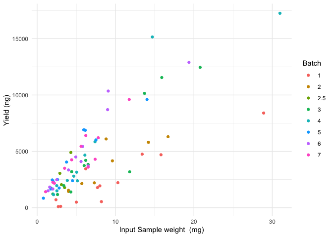
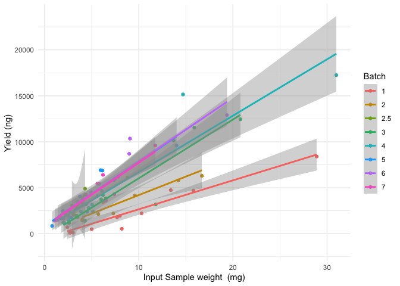
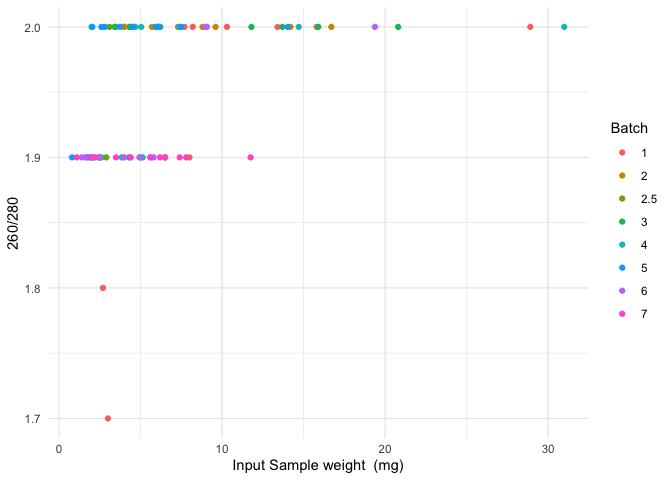
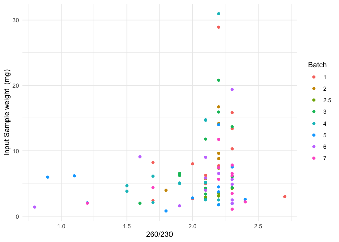

# Summary

### Overview - Exp 23 Extraction

details:

[Drive folder link](https://drive.google.com/drive/u/0/folders/1Hol6ktlDViiKfrVa1tLDwSl3-bCFDLBG)

### Planning

Gills first, sample count: 83, then library prep

pilot brain extraction then Bio A

then library prep of gills

Brains extractions after, sample count: 18

toss under performers and index up to 96

Extraction plan:

-   Gills - Cryofracture in Lysing Matrix A tubes using coolPrep adapter for 45 sec at a speed setting of 6.5 m/s. NEB spin column RNA extraction. 30 min pro K incubation

-   Brain- Cryofracture in Lysing Matrix D tubes using coolPrep adapter for 20 sec at a speed setting of 4 m/s. NEB spin column RNA extraction std protocol

Library prep plan: need 1 ug input

multiplexing plan: 96 indexes that we currently have in hand

##### Sequencing strategy

Month of Experiment: 6/24

### Sample Storage

##### Gills -

tube ids: HG24001 - HG24083

box label:

storage location and temperature: Kelley Lab -20

##### Brains -

tube ids: HB24001 - HB24083

box label:

storage location and temperature: Kelley Lab -20

##### RNA extracts:

tube ids: E##\_HG01-E##HG83

boxes: Germany RNA Seq Extractions Summer '24 MIOK Box \# of 2

storage location and temperature: CBB Freezer Room -80

# Input v Yield

<!-- --><!-- --><!-- --><!-- -->

# [Exp23_Protocol](https://docs.google.com/spreadsheets/d/1KRz4BxfZMiVuNSRogQ07To1Xo2KI_hLexjCjcoXvzPQ/edit#gid=1649175478)

## Materials List

## Kit Particulars & Lot Numbers

| part                                                        | part no | lot         |
|-------------------------------------------------------------|---------|-------------|
| Lysing Matrix A tube                                        | 6910100 | U1124135919 |
| NEB monarch total RNA MiniPrep kit - 1st kit opened 3/19/24 | T2010S  | 10175994    |
| NEB monarch total RNA MiniPrep kit - 2nd kit opened 6/20/24 | T2010S  | 10210910    |

kit details

**1st kit**

O: 3/24 by Blair Perry, consumed a couple rxns (unkown specific amount)

-   proteinase K reconstituted 6/10/24 by MIOK, made 4 aliquots total, stored in the -20

-   DNAse 1 reconstituted 3/24 by Blair Perry\* not aliquoted, stored in the -20

-   RNA Wash Buffer mixed with 200 proof EtOH ??, stored at RT

**2nd kit**

O: 6/20/24 by MIOK

-   proteinase K reconstituted 6/20/24 by MIOK, made 4 aliquots total, stored in the -20

-   DNAse 1 reconstituted 6/20 by MIOK, made 4 aliquots total, stored in the -20

-   RNA Wash Buffer mixed with 200 proof EtOH 6/20/24 by MIOK, stored at RT

# Log

### 06/11/24

did 12 extraction reactions with Owen and Dalya shadowing me. Some samples had good yield. Some did not. The juvenile gills are super duper tiny and yield from them was pretty low as well. Need to look at minimum input into library prep to see if I need to do repeats.

Moving forward how to tackle juvenile gill extractions? Should I use two gills?

-   Kara Ryan suggested tackling the tissue homogenization individually for the juvenile gills . she employed that stratego with other small tissues before

    -    *concerned with not recovering the max amount of gill from smash bag possible because itll be stuck in the corners and along sides of the smash bag*

-   can i make sure to elute in lower volume for juveniles so it is more concentrated

    -   35-40 ul? min volume for elution to wet membrane is 50 ul

    -   elution in 30 µl results in \> 80% recovery and 100 µl provides maximum recovery

Q's

-what is min tissue input into extraction kit? not explicitly stated but seems like below 5 is sus

-what is min input into library prep? 10 ng

-what is max input into library prep? 1 ug

### 6/13/24

Did 8 extractions of the next batch of samples. Omitted Juvenile samples from batch with the intention of processing those samples post consensus on how to proceed with them. Owen, Dalya, and Emma were present for a portion of the extraction as shadows.

RNA Quant and Qual looked good.

#### Juvenile Gill RNA Extraction optimization options

Looking into sample disruption optimization (flash freeze and dry mill?)

lysis optimization (change reagent amounts?)

double input? (two gills?)

### 6/14/24

Eli from NEB Technical Support passed along two recommendations to facilatate better lysis after speaking with the developer of the kit. She made the following two recommendations:

1.  Try smaller beads, like [these ones](https://www.zymoresearch.com/collections/lysis-tubes/products/zr-bashing-bead-lysis-tubes) from Zymo

2.  Try a longer ProK digestion. You can go up to 30 minutes.

#### Plan for extractions

Extend Pro k digestion from 5 min to 30 min with 4 juvenile samples. Look at results and reassess outcome

Yield from the extractions of the four juvenile samples ranged from 2-5.6 ug. Good results so far!

Other things I did:

-   I made sure to try to "bury" the sample in the lysing matrix A garnet flakes. Observed supernatant that was less clear then the 1st batch juvenile supernatants post cryofracture

-   I made sure to add buffers (priming buff, wash buff) on top of columns prior to removing waste below to avoid drying out the columns.

    Results seem promising!

### Next Steps

Compare fragment profile (Bioanalyzer) results from 1st batch of juvenile extractions to the longer digestion batch (today's samples) as well as spot check the other samples.

### 6/18/2023

-   12 samples processed - results look alright

### 6/20/2023

-   new kit opened. DNAse aliquots prepared. proteinase K reconstituted and aliquoted. Wash buffer etoh added

-   12 samples processed

### 6/25/2023

12 samples processed

### 6/27/2023

11 gill samples extracted

260/230 still not across the board great despite being very careful with the lysis buffer

### Brain Extraction Notes

Lysing Matrix D is used primarily for lysis of softer tissues like brain

4.0 m/s for 20 seconds

<https://doi.org/10.1093/infdis/jiad563>

recco input of 10 mg. max input of 50 mg

<https://www.neb.com/en-us/-/media/nebus/files/manuals/manualt2010.pdf?rev=175a03b980f84584b7353d73dd6cba54&hash=93B1804F5634464706E58663FCD33B6C>

### Notes

For last batch: watch it with the lysis buffer!!!

Finish the gills. Do pilot of the brain. BioA check up of the last of the gills

??? Redo extraction of some samples.

Next week: Start Library prep of gills. Increase PCR cycle from 10 to 11?

After that: Extraction of 18 brains – very specific brains. then lib prep of them

Overall: No muscle and not other brains, 83+18

5 brains will be tossed

Index with the indexes we currently have

Fish ID of Brains selected for Rna extraction

H24005, H24006, H24009, H24010, H24011, H24012, H24001, H24002, H24003, H24004, H24007, H24008, H24013, H24014, H24023, H24024, H24025, H24026

Pilot test on sample: H24041
