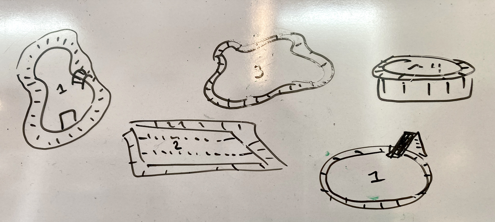

# Overview

Samples were either normalized to 5 ng/ul or left undiluted if the initial samples concentration was below 7 ng/ul and then pooled for sequencing.

# Summary

[Drive folder link](https://drive.google.com/drive/u/0/folders/1Hol6ktlDViiKfrVa1tLDwSl3-bCFDLBG)

**Pooling Libraries Planning**

• Concentration (ng/uL) determined by the Qubit

• Average fragment size (bp) in the 100-1200bp region based on a previous RNA seq Pool

❑ Plan to Normalize samples to around 5 ng/ul.

If samples are already below 5ng/ul --\> leave undiluted

or are too near 5 ng/ul to be effectively diluted --\> those were also left undiluted

• Pipette no less than 2uL of any library or diluent

• Final pool concentration should be above 3 nM

• total pool volumes at least 30uL. ideally 50 ul

**Pooling Libraries**

*diluted samples:*

❑ add diluent to strip tubes for dilution

❑add sample into diluent, pip to mix

Pool 3 ul of each diluted sample in a 1.5ml Lo Bind tube

*undiluted samples:*

❑ Carefully add the specified volume of each library to the tube

Once the pool has been created, store leftover libraries at -20C.

The pool may be stored at -20C until shipped out for sequencing

Month of Experiment: 7/24

# Sample Normalization & Pooled volumes

15 ng input per sample into pool (ul)

Click me for table

|                      |                    |              |                         |
|------------------|------------------|------------------|--------------------|
| Library Prep Tube ID | ul Library diluted | diluant (ul) | **Pooling Volume (ul)** |
| 1                    | \-                 | \-           | 2.48                    |
| 2                    | \-                 | \-           | 2.56                    |
| 3                    | \-                 | \-           | 4.05                    |
| 4                    | \-                 | \-           | 4.64                    |
| 5                    | \-                 | \-           | 6.02                    |
| 6                    | \-                 | \-           | 6.55                    |
| 7                    | \-                 | \-           | 5.26                    |
| 8                    | \-                 | \-           | 2.28                    |
| 9                    | \-                 | \-           | 3.83                    |
| 10                   | 3                  | 4.1          | 3                       |
| 11                   | 3                  | 3.7          | 3                       |
| **12**               | \-                 | \-           | 4.05                    |
| 13                   | 3                  | 3.4          | 3                       |
| 14                   | 3                  | 2.8          | 3                       |
| 15                   | 3                  | 2.3          | 3                       |
| 16                   | \-                 | \-           | 2.63                    |
| **17**               | 2                  | 12.7         | 3                       |
| **18**               | 3                  | 13.0         | 3                       |
| **19**               | 3                  | 9.2          | 3                       |
| **20**               | 2                  | 10.1         | 3                       |
| **21**               | 3                  | 13.2         | 3                       |
| 22                   | \-                 | \-           | 3.45                    |
| **23**               | 2                  | 12.6         | 3                       |
| 24                   | \-                 | \-           | 5.03                    |
| 25                   | 3                  | 4.0          | 3                       |
| 26                   | 3                  | 2.8          | 3                       |
| 27                   | \-                 | \-           | 2.21                    |
| **28**               | 3                  | 2.2          | 3                       |
| 29                   | 3                  | 3.5          | 3                       |
| 30                   | 3                  | 2.1          | 3                       |
| 31                   | \-                 | \-           | 2.90                    |
| 32                   | \-                 | \-           | 2.14                    |
| **33**               | \-                 | \-           | 3.53                    |
| **34**               | \-                 | \-           | 4.64                    |
| **35**               | \-                 | \-           | 4.36                    |
| **36**               | \-                 | \-           | 3.33                    |
| **37**               | \-                 | \-           | 6.28                    |
| 38                   | 3                  | 3.5          | 3                       |
| **39**               | \-                 | \-           | 5.15                    |
| 40                   | \-                 | \-           | 4.00                    |
| 41                   | 3                  | 5.4          | 3                       |
| 42                   | 3                  | 4.3          | 3                       |
| 43                   | 3                  | 5.8          | 3                       |
| **44**               | 3                  | 5.5          | 3                       |
| 45                   | 3                  | 3.4          | 3                       |
| 46                   | 3                  | 5.0          | 3                       |
| 47                   | 3                  | 8.2          | 3                       |
| 48                   | 3                  | 7.8          | 3                       |
| **49**               | 3                  | 4.8          | 3                       |
| **50**               | 3                  | 4.7          | 3                       |
| **51**               | 3                  | 5.3          | 3                       |
| **52**               | 3                  | 4.0          | 3                       |
| **53**               | 3                  | 4.3          | 3                       |
| 54                   | 3                  | 3.7          | 3                       |
| **55**               | 3                  | 5.6          | 3                       |
| 56                   | 3                  | 12.6         | 3                       |
| 57                   | 3                  | 10.0         | 3                       |
| 58                   | 3                  | 5.5          | 3                       |
| 59                   | 3                  | 7.4          | 3                       |
| **60**               | 3                  | 6.2          | 3                       |
| 61                   | 3                  | 5.4          | 3                       |
| 62                   | 3                  | 11.1         | 3                       |
| 63                   | 2                  | 12.4         | 3                       |
| 64                   | 3                  | 4.0          | 3                       |
| **65**               | 3                  | 6.1          | 3                       |
| **66**               | 3                  | 11.4         | 3                       |
| **67**               | 3                  | 13.7         | 3                       |
| **68**               | \-                 | \-           | 1.97                    |
| **69**               | 3                  | 6.2          | 3                       |
| 70                   | 3                  | 6.7          | 3                       |
| **71**               | 3                  | 11.5         | 3                       |
| 72                   | 3                  | 13.9         | 3                       |
| 73                   | 3                  | 6.6          | 3                       |
| 74                   | 3                  | 7.9          | 3                       |
| 75                   | 3                  | 6.2          | 3                       |
| **76**               | 3                  | 7.9          | 3                       |
| 77                   | 3                  | 4.2          | 3                       |
| 78                   | 3                  | 7.3          | 3                       |
| 79                   | 3                  | 9.5          | 3                       |
| 80                   | 3                  | 10.0         | 3                       |
| **81**               | 2                  | 11.3         | 3                       |
| **82**               | 2                  | 13.7         | 3                       |
| **83**               | 3                  | 9.1          | 3                       |
| **84**               | 2                  | 10.2         | 3                       |
| **85**               | 2                  | 14.3         | 3                       |
| 86                   | 2                  | 15.6         | 3                       |
| **87**               | 2                  | 13.8         | 3                       |
| 88                   | 3                  | 14.2         | 3                       |
| 89                   | 2                  | 10.8         | 3                       |
| 90                   | 2                  | 10.6         | 3                       |
| 91                   | 2                  | 13.0         | 3                       |
| 92                   | 3                  | 14.3         | 3                       |
| 93                   | 2                  | 10.1         | 3                       |
| 94                   | 2                  | 11.9         | 3                       |
| 95                   | 2                  | 12.6         | 3                       |
| 96                   | 2                  | 11.7         | 3                       |

# Sample Storage

RNA libraries:

tube ids: Germany RNA Seq 1-96

box: Germany RNA Seq Libraries Summer '24 MIOK

storage location and temperature: Kelley Lab -20

Pool:

tube id: Germany RNA Seq Pool Aliquot 1 & 2

box: Germany RNA Seq Libraries Summer '24 MIOK

storage location and temperature: Kelley Lab -20

# Remaining Normalized Sample volumes post pooling

Click me for table

|                      |               |                                                           |
|:--------------------:|:-------------:|:---------------------------------------------------------:|
| Library Prep Tube ID | concentration | amount of diluted sample or undiluted sample post pooling |
|          1           |     6.05      |                           17.52                           |
|          2           |     5.86      |                           17.44                           |
|          3           |      3.7      |                           15.95                           |
|          4           |     3.23      |                           15.36                           |
|          5           |     2.49      |                           13.98                           |
|          6           |     2.29      |                           13.45                           |
|          7           |     2.85      |                           14.74                           |
|          8           |     6.57      |                           17.72                           |
|          9           |     3.92      |                           16.17                           |
|          10          |       5       |                            4.1                            |
|          11          |       5       |                            3.7                            |
|          13          |      3.7      |                           15.95                           |
|          14          |       5       |                            3.4                            |
|          15          |       5       |                            2.8                            |
|          16          |       5       |                            2.3                            |
|          22          |      5.7      |                           17.37                           |
|          24          |       5       |                           11.7                            |
|          25          |       5       |                           13.0                            |
|          26          |       5       |                            9.2                            |
|          27          |       5       |                            9.1                            |
|          28          |       5       |                           13.2                            |
|          29          |     4.35      |                           16.55                           |
|          30          |       5       |                           11.6                            |
|          31          |     2.98      |                           14.97                           |
|          32          |       5       |                            4.0                            |
|          33          |       5       |                            2.8                            |
|          34          |      6.8      |                           17.79                           |
|          35          |       5       |                            2.2                            |
|          36          |       5       |                            3.5                            |
|          37          |       5       |                            2.1                            |
|          39          |     5.18      |                           17.10                           |
|          40          |     7.01      |                           17.86                           |
|          41          |     4.25      |                           16.47                           |
|          42          |     3.23      |                           15.36                           |
|          43          |     3.44      |                           15.64                           |
|          44          |     4.51      |                           16.67                           |
|          45          |     2.39      |                           13.72                           |
|          46          |       5       |                            3.5                            |
|          47          |     2.91      |                           14.85                           |
|          48          |     3.75      |                           16.00                           |
|          49          |       5       |                            5.4                            |
|          50          |       5       |                            4.3                            |
|          51          |       5       |                            5.8                            |
|          52          |       5       |                            5.5                            |
|          53          |       5       |                            3.4                            |
|          54          |       5       |                            5.0                            |
|          55          |       5       |                            8.2                            |
|          56          |       5       |                            7.8                            |
|          57          |       5       |                            4.8                            |
|          58          |       5       |                            4.7                            |
|          59          |       5       |                            5.3                            |
|          60          |       5       |                            4.0                            |
|          61          |       5       |                            4.3                            |
|          62          |       5       |                            3.7                            |
|          63          |       5       |                            5.6                            |
|          64          |       5       |                           12.6                            |
|          65          |       5       |                           10.0                            |
|          66          |       5       |                            5.5                            |
|          67          |       5       |                            7.4                            |
|          68          |       5       |                            6.2                            |
|          69          |       5       |                            5.4                            |
|          70          |       5       |                           11.1                            |
|          71          |       5       |                           11.4                            |
|          72          |       5       |                            4.0                            |
|          73          |       5       |                            6.1                            |
|          74          |       5       |                           11.4                            |
|          75          |       5       |                           13.7                            |
|          76          |     7.62      |                           18.03                           |
|          77          |       5       |                            6.2                            |
|          78          |       5       |                            6.7                            |
|          79          |       5       |                           11.5                            |
|          80          |       5       |                           13.9                            |
|          81          |       5       |                            6.6                            |
|          82          |       5       |                            7.9                            |
|          83          |       5       |                            6.2                            |
|          84          |       5       |                            7.9                            |
|          85          |       5       |                            4.2                            |
|          86          |       5       |                            7.3                            |
|          87          |       5       |                            9.5                            |
|          88          |       5       |                           10.0                            |
|          89          |       5       |                           10.3                            |
|          90          |       5       |                           12.7                            |
|          91          |       5       |                            9.1                            |
|          92          |       5       |                            9.2                            |
|          93          |       5       |                           13.3                            |
|          94          |       5       |                           14.6                            |
|          95          |       5       |                           12.8                            |
|          96          |       5       |                           14.2                            |
|          12          |       5       |                            9.8                            |
|          17          |       5       |                            9.6                            |
|          18          |       5       |                           12.0                            |
|          19          |       5       |                           14.3                            |
|          20          |       5       |                            9.1                            |
|          21          |       5       |                           10.9                            |
|          23          |       5       |                           11.6                            |
|          38          |       5       |                           10.7                            |

# Notes

things I looked at while planning this out:

pooling strategies -

<https://dnatech.genomecenter.ucdavis.edu/faqs/how-do-i-pool-sequencing-libraries-can-you-pool-them-for-us/>

<https://www.reddit.com/r/labrats/comments/re4e7t/question_about_sample_dilution_for_ngs/>

pooling pools -

<https://knowledge.illumina.com/library-preparation/general/library-preparation-general-reference_material-list/000008258>
