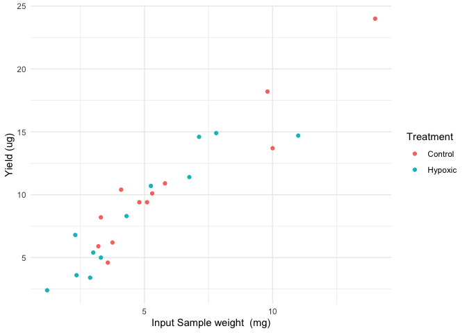

# Overview

The gill tissue samples were homogenized in MP Bio Matrix A tubes using a Fast Prep 5G with cool prep adapter. Gill arch RNA was then extracted using the NEB monarch total RNA MiniPrep kit following the standard tissue protocol for the kit with one modification, a proteinase k incubation time of 15 minutes at 300 rpm.

Upon completion of extractions of all samples, proceeded to library prep.

[Library Prep Lab Notebook Entry](https://isabel-kline.github.io/Kelley_Lab_Notebook/Gillii_RNA_Libraries.html)

# Summary

Poecilia gillii gills - 24 extractions from control and hypoxic S/NS fish gills

[Drive folder link](https://drive.google.com/drive/folders/1N9ebukVfd9IsLPw2OFkqJCr_8oMp0GTy)

Extraction plan:

-   Gills - Cryofracture in Lysing Matrix A tubes using coolPrep adapter for 45 sec at a speed setting of 6.5 m/s. NEB spin column RNA extraction.

Month of Experiment: 8/24

# Sample Storage

**Gills**

tube ids: BWR24_0##

box label:BWR24_001 to. Costa Rica RNALater filled 12/06/23

storage location and temperature: Kelley Lab -80

**RNA extracts**

tube ids: 0##\_E##

boxes: Gillii Gill RNA Seq Extractions Summer '24 MIOK Box 1 of 1

storage location and temperature: CBB Freezer Room -80

# Input to Yield

<!-- -->

# [Exp29_Protocol](https://docs.google.com/spreadsheets/d/1mdKU-nXcEaraULA1sr7dwBripUXnzSDtDnUGB7AWCd8/edit?gid=925856207#gid=925856207)

-   put lysis buffer in tubes prior to transfer of samples

-   place reagents on columns prior to removal of under waste to avoid drying out column

-   incubate all washes/primers for a time after addition onto column prior to spin.

-   Elution vol of 80 ul

## Kit Particulars & Lot Numbers

| part                                                        | part no | lot         |
|-----------------------------------|------------------|------------------|
| Lysing Matrix A tubes                                       | 6910100 | U1124135919 |
| NEB monarch total RNA MiniPrep kit - 3rd kit. opened 7/2/24 | T2010S  | 10210910    |

T2010S kit details

O: 7/2/24 by MIOK

-   proteinase K reconstituted 7/2/24 by MIOK, made 3 aliquots total, stored in the -20

-   DNAse 1 reconstituted 7/2/24 by MIOK, made 3 aliquots total, stored in the -20

-   RNA Wash Buffer mixed with 200 proof EtOH 7/2/24 by MIOK, stored at RT

# Log

Click me for log entries

### 08/01/2024

Set up documents today. Labeled RNA extraction tubes today. Randomized order of sample processing from the initial sample sheet.

### 08/02/2024

12 extractions

decided to do 15 min proteinase K digestion at 300 rpm

post priming wash incubated for 2 min on top of col prior to spin down

2nd and final wash incuabted for 3 min atop of the col prior to 2 min spin down

elution volume was 80 ul

### 08/06/2024

12 extractions

15 min proteinase K digestion at 300 rpm

post priming wash incubated for 2 min on top of col prior to spin down

2nd and final wash incuabted for 3 min atop of the col prior to 2 min spin down

elution volume was 80 ul

