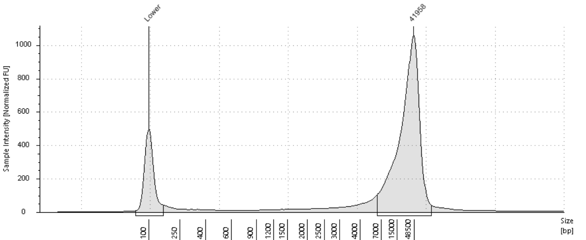

```{r setup, include=FALSE}
knitr::opts_chunk$set(echo = TRUE)
```

<https://dnatech.genomecenter.ucdavis.edu/sample-requirements/>

# Samples 

-   l dearborni

-   [OGL Gill](https://isabel-kline.github.io/Kelley_Lab_Notebook/OGL_Gill_HMW.html), Lycodes Concolor - Submission requirements met.

-   [Gar](https://isabel-kline.github.io/Kelley_Lab_Notebook/Gar_HMW.html) - Two extractions- Submission requirements not met. **Tropical Troubles**

-   Gunnel - not on deck

-   MB Eelpout - Exp 13

-   M pamellas - Exp 6,7,8

|                            |                    |              |                   |                      |                   |                   |
|:----------|:---------:|:---------:|:---------:|:---------:|:---------:|:---------:|
| **PacBio Library Preps**   |     **Notes**      | **Quantity** | **Concentration** | **Preferred Buffer** | **260/280 ratio** | **260/230 ratio** |
| HiFi libraries multiplexed | Gel Image Required |     3 ug     |   \>= 100 ng/ul   |          TE          |      1.8-2.0      |        \>2        |
| HiFi libraries             | gel image required |     6 ug     |   \>= 100 ng/ul   |          TE          |      1.8-2.0      |        \>2        |

*Samplesheet*

|           |               |                 |            |                   |                |                   |                   |
|---------|-----------|-----------|---------|:-------:|---------|:-------:|:-------:|
| Davis Run | STube ID      | Gel Image       | Quantity   | **Concentration** | Buffer         | **260/280 ratio** | **260/230 ratio** |
| A         | ebony ogl hmw | peak - 41958 bp | 19.725 ug  |        263        | Circulomics EB |        1.8        |        2.1        |
| B         |               |                 |            |                   |                |                   |                   |
| C         | SRE EP1       | peak - 40000 bp | 2.5 ug     |       25.1        | SRE EB         |                   |                   |
|           |               |                 |            |                   |                |                   |                   |
|           | HiFi Gar      |                 | 2.17125 ug |       28.95       | Circulomics EB |       1.837       |       1.27        |

#### Fragment Analysis Results

{width="617"}



## Sample Storage

##### DNA extracts:

tube id: OGL Gill HMW

box: pink box

storage location and temperature: 4C Kelley Lab
